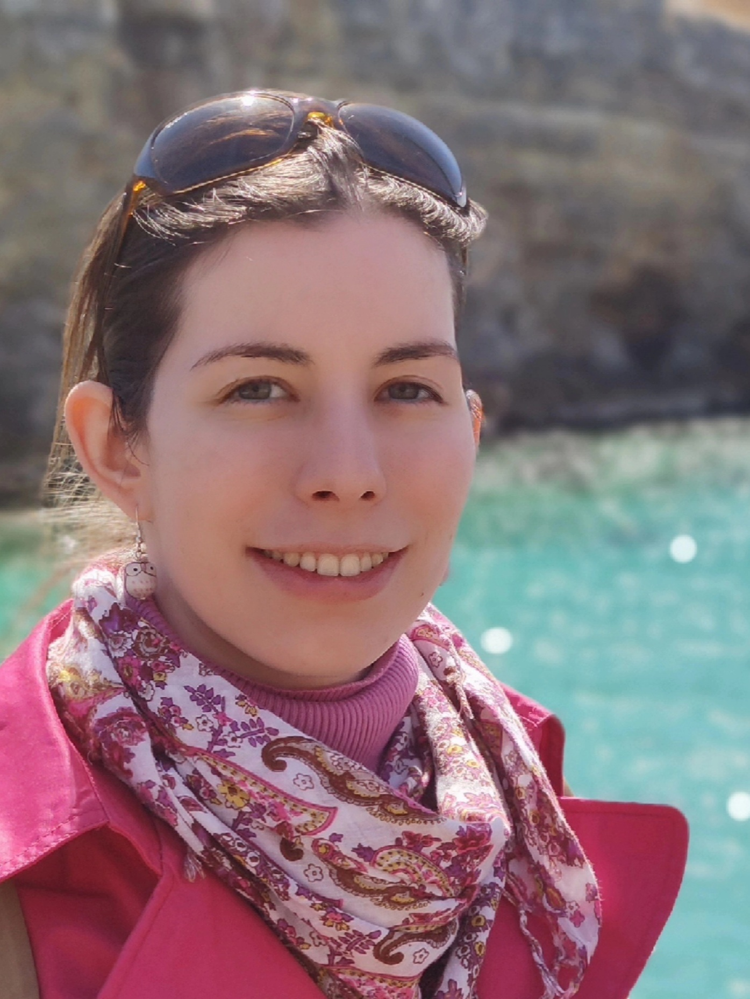

# Anna Kerekes

akerekes@ethz.ch

## Research Interest
My research interests include, but are not limited to Machine Learning Theory, Bayesian Inference and Optimization. My academic foundation lies in the realm of Mathematics, particularly within the field of Statistics. I have previously worked on theoretical description of inductive biases and performance of optimization algorithms.

## Papers
[Expressiveness Remarks for Denoising Diffusion Models and Samplers](https://arxiv.org/abs/2305.09605) Francisco Vargas, Teodora Reu, Anna Kerekes
[Rethinking Sharpness-Aware Minimization as Variational Inference](https://arxiv.org/abs/2210.10452) Szilvia Ujváry, Zsigmond Telek, Anna Kerekes, Anna Mészáros, Ferenc Huszár
[Depth Without the Magic: Inductive Bias of Natural Gradient Descent](https://arxiv.org/abs/2111.11542) Anna Kerekes, Anna Mészáros, Ferenc Huszár

## Online Presence
[Google Scholar](https://scholar.google.com/citations?view_op=list_works&hl=hu&hl=hu&user=JI1kuu0AAAAJ)

[LinkedIn](https://hu.linkedin.com/in/anna-kerekes13?challengeId=AQEUyN_8mGszCQAAAYsFHfr2OyFIDXUU_1falhlZUANxe9AL2_f7Pnz1AXGFUVNLO3lQ8mugvI3OaMz41qD_It85c9wVCKsBrA&submissionId=2c6620a4-d486-8b17-eaa0-e5746927cd5a&challengeSource=AgFIpZHuzmEE4QAAAYsFHj0hpH_LOwh9I0BorMXfXqT4q1t7wNmPTa-vVBAWS7w&challegeType=AgH_S9uwpf8FbwAAAYsFHj0jUt1Ss3PGVh-oG7skfhwZGCx47FWL1h0&memberId=AgEn0kfudfDkxAAAAYsFHj0mlc1xK8UXOEdzqgYQyzlmy78&recognizeDevice=AgG9ayNQ0pIPywAAAYsFHj0pAPhVbo0S0z_H1kq8LDiA18n7oGii)

